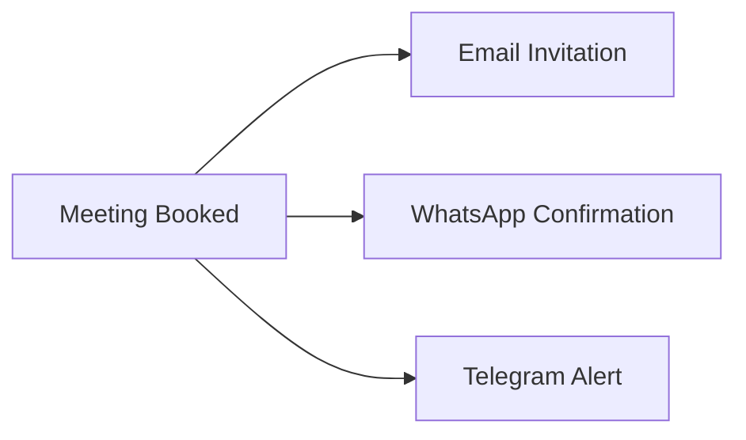

# ChatBotYodha
AI-powered customer service & marketing assistant for product-based industries, built with LangChain, Azure, and modern LLMs.

---

## 🗂️ Repository Overview

This repository provides a robust, secure, and extensible chatbot platform for:
- **Customer Service**: Product queries, support, and sales analytics
- **Marketing Appointment Scheduling**: Book meetings with marketing staff, including phone and calendar integration (Google/Teams)
- **Multi-step Reasoning**: Advanced agentic workflows for complex queries
- **Secure Credential Management**: All secrets are managed via `.env` and `credentials.json` (see [Secrets Setup Guide](SECRETS_SETUP_GUIDE.md))

---


## ✨ Features

### 🎯 Core Functionality
- **Conversational AI**: Context-aware, multi-step reasoning
- **Function-Call Architecture**: Structured, reliable, and maintainable (see [Function Calls](FUNCTION_CALLS_IMPLEMENTATION.md))
- **Session Management**: Persistent chat sessions, export, and sharing
- **Real-time Database Integration**: Customer, product, sales, and activity data
- **Marketing Meeting Scheduling**: Book with marketing staff, select by expertise, timezone-aware, phone in invite, Google/Teams calendar integration

### 💬 Communication Channels
- **Web UI**: Streamlit app for chat and appointment booking
- **Email & SMS**: Send chat summaries and meeting invites

### 📬 Booking Notification Flow

When a meeting is booked, notifications are sent through multiple channels:

1. **Email** - Calendar invitation with full meeting details, agenda, and connection info
2. **WhatsApp** - Instant confirmation via Twilio with meeting summary
3. **Telegram** - Optional notification via Telegram Bot for real-time alerts



**Key files:**
- [app/services/email_service.py](app/services/email_service.py) - Email + multi-channel orchestration
- [app/services/messaging.py](app/services/messaging.py) - WhatsApp (`SMSService`, `WhatsAppService`) and Telegram (`TelegramService`) services

### 📅 Google Calendar Integration

The system integrates with Google Calendar API for real meeting scheduling:

- **Timezone-aware event creation** - Respects organizer and attendee timezones
- **Automatic email invitations** - Sends calendar invites to all attendees
- **Free/busy time checking** - Checks availability before booking
- **Teams meeting link generation** - Optional Microsoft Teams integration
- **Professional meeting templates** - Rich descriptions with agenda and connection details

**Key files:**
- [google_calendar_integration.py](google_calendar_integration.py) - Main Google Calendar adapter with OAuth2
- [teams_integration.py](teams_integration.py) - Enhanced adapter with Teams meeting support
- [app/chatbot/marketing_scheduler.py](app/chatbot/marketing_scheduler.py) - Scheduler orchestration

### 🔐 Notification Environment Variables

| Variable | Service | Description |
|----------|---------|-------------|
| `TWILIO_ACCOUNT_SID` | WhatsApp | Twilio account ID |
| `TWILIO_AUTH_TOKEN` | WhatsApp | Twilio auth token |
| `TWILIO_WHATSAPP_NUMBER` | WhatsApp | Twilio WhatsApp sender number (e.g., `whatsapp:+14155238886`) |
| `TELEGRAM_BOT_TOKEN` | Telegram | Telegram bot token from @BotFather |
| `SMTP_USERNAME` | Email | Gmail address for sending emails |
| `SMTP_PASSWORD` | Email | Gmail app password (16 characters) |

### 🗄️ Data Management
- **Azure PostgreSQL**: Business data
- **Azure Blob Storage**: Conversation persistence (optional)

### 🤖 AI & LLM Support
- **OpenAI GPT-4** (production)
- **Ollama Local Models** (privacy/local)
- **Groq** (fast inference)
- **Automatic fallback** between providers

---


## 🏗️ Project Structure

```
genai_chatbot/
├── app/
│   ├── api/                 # FastAPI endpoints (customers, products, sales, activities, marketing, etc.)
│   ├── chatbot/             # Agent logic, multi-step reasoning
│   ├── models/              # SQLAlchemy & Pydantic models
│   ├── services/            # Email, storage, messaging
│   └── database.py          # DB config
├── sql_scripts/             # DB schema & sample data
├── streamlit_app.py         # Main Streamlit UI (chat, scheduling)
├── requirements.txt         # Python dependencies
├── .env.example             # Example config (no secrets)
├── credentials.example.json # Example Google OAuth config
├── SECRETS_SETUP_GUIDE.md   # How to set up credentials (see below)
├── MULTISTEP_FUNCTION_CALLING.md # Multi-step agent architecture
├── FUNCTION_CALLS_IMPLEMENTATION.md # Function-call design
├── test_*.py                # Test scripts
└── README.md                # This file
```

---


## 🚀 Quick Start


### 📋 Prerequisites
- **Python 3.12+**
- **PostgreSQL Database** (Azure recommended)
- **OpenAI API Key** or **Ollama** (local LLM)
- **Google Cloud Project** (for calendar integration)
- **Azure AD App Registration** (for Teams integration)
- **Gmail App Password** (for email)

### 1️⃣ **Clone & Environment Setup**

```powershell
# Clone the repository
git clone https://github.com/rajuts/ChatBotYodha.git
cd ChatBotYodha

# Create virtual environment with Python 3.12
python -m venv venv312

# Activate virtual environment
.\venv312\Scripts\Activate.ps1  # Windows PowerShell
# source venv312/bin/activate    # Linux/Mac

# Install dependencies
pip install -r requirements.txt
```

### 2️⃣ **Database Setup**

```


### 3️⃣ Environment Configuration

1. **Copy** `.env.example` to `.env` and fill in your real credentials.
2. **Copy** `credentials.example.json` to `credentials.json` and set up Google OAuth (see [Secrets Setup Guide](SECRETS_SETUP_GUIDE.md)).
3. **Never commit `.env` or `credentials.json` to git!**

See `.env.example` for all required fields.

### 4️⃣ **Launch Application**

```powershell
# Activate virtual environment
.\venv312\Scripts\Activate.ps1

# Start the application (runs both FastAPI and Streamlit)
streamlit run streamlit_customer_service.py
```


---

## 🧑‍💻 Main User Flows

### 1. Product & Customer Queries
- Use the Streamlit app to chat with the AI about products, customers, sales, and analytics.
- Multi-step reasoning: The agent chains function calls for deep-dive answers ([see details](MULTISTEP_FUNCTION_CALLING.md)).

### 2. Marketing Appointment Booking
- Book meetings with marketing staff via chat or UI.
- Select marketing person by expertise; phone number included in invite.
- Handles timezones and real calendar integration (Google/Teams).

### 3. Secure Onboarding & Secrets Management
- All secrets are managed via `.env` and `credentials.json` (see [Secrets Setup Guide](SECRETS_SETUP_GUIDE.md)).
- Example config files provided: `.env.example`, `credentials.example.json`.
- `.gitignore` is pre-configured to exclude all sensitive files.

---

### 🤖 **LLM Provider Setup**

#### **Option 1: OpenAI (Recommended)**
1. Get API key from https://platform.openai.com/
2. Add to `.env`: `OPENAI_API_KEY=sk-your-key`
3. Set: `LLM_PROVIDER=openai`

#### **Option 2: Ollama (Local/Privacy)**
```powershell
# Install Ollama
# Download from: https://ollama.ai/
ollama serve

# Pull models
ollama pull llama2
ollama pull codellama

# Configure in .env
OLLAMA_BASE_URL=http://localhost:11434
LLM_PROVIDER=ollama
```

### 📧 **Email Setup (Gmail)**

#### **Step 1: Enable 2-Factor Authentication**
1. Go to https://myaccount.google.com/security
2. Enable "2-Step Verification"

#### **Step 2: Generate App Password**
1. Go to https://myaccount.google.com/apppasswords
2. Select "Mail" and "Windows Computer"
3. Copy the 16-character password (remove spaces!)

#### **Step 3: Configure Environment**
```env
SMTP_USERNAME=your_gmail@gmail.com
SMTP_PASSWORD=abcdefghijklmnop  # 16-char app password, no spaces!
FROM_EMAIL=your_gmail@gmail.com
```


## � Security & Onboarding

- **Never commit real secrets to git.**
- Use `.env.example` and `credentials.example.json` as templates.
- Follow [SECRETS_SETUP_GUIDE.md](SECRETS_SETUP_GUIDE.md) for step-by-step credential setup (Google, Teams, Azure, Gmail, Twilio, etc).
- Rotate credentials regularly and use strong passwords/API keys.

---

## 📚 Further Documentation

- [SECRETS_SETUP_GUIDE.md](SECRETS_SETUP_GUIDE.md): How to set up all credentials and secrets
- [MULTISTEP_FUNCTION_CALLING.md](MULTISTEP_FUNCTION_CALLING.md): Multi-step agent architecture
- [FUNCTION_CALLS_IMPLEMENTATION.md](FUNCTION_CALLS_IMPLEMENTATION.md): Function-call based design

---

## 🛡️ Code Standards
- Follow PEP 8 Python style guide
- Add docstrings to all functions
- Include tests for new features
- Update README and example configs for new features
